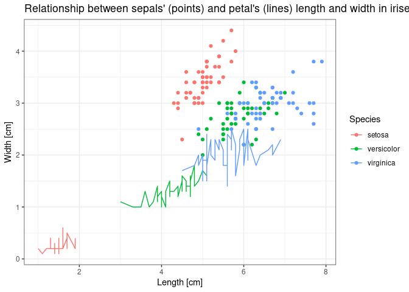

Introduction to R - class 4
================
**Tomek Gaczorek**; <tomek.gaczorek@gmail.com>
25.10.22

<!-- **!!! Decriptions of exercises are in green !!!** -->
<!-- **!!! Advanced parts are marked with the red asterixis !!!** -->

### 1. Your own functions

You already know many built-in functions. Now, it is time to create your
own! The syntax is as follows:

``` r
function_name <- function(argument_name){
  # actions to be made based on argument
  return(outcome)
}
```

The rule of thumb is that what you put inside *return()* is a function’s
result and it is the only thing that is going to be returned. All others
actions are invisible outside of function. Think about functions as
being LAS VEGAS, what happens inside stays inside.

**Curiosity**  
Even though the recommended *return()* adds clarity to your code, it is
not necessary. If not used, the last evaluated expression will be
returned. In our example above, typing “outcome” instead of
“return(outcome)” will work identically. Both will result in calling
*outcome* variable.

When a function is defined it can be used by:

``` r
function_name(argument_name = argument_value)
```

**Ex 1. Create a function that calculates the length of square diagonal
based on the side length. Test it for 1, 5 and 10.**  
Expected result:

    [1] 1.414214

    [1] 7.071068

    [1] 14.14214

**Ex 2. Create a function called *my_mean* that takes a vector as an
argument and calculates arithmetic mean. Do not use *mean()* function.
Test it on a vector from 1 to 50.**  
Expected result:

    [1] 25.5

Functions can take many arguments at the same time. The change in syntax
is subtle:

``` r
function_name <- function(argument_name_1,argument_name_2,...){
  # actions to be made based on all arguments
  return(outcome)
}
```

Execute the code below to create the dataset called *pizza*. It includes
the lengths of square sides (*square_side*) and the lengths of cirle
diameters (*circle_diameter*). The units are centimeters.

``` r
pizza <- data.frame(square_side = seq(10,40,2),circle_diameter = seq(10,40,2))
```

Our aim will be to assess which pizzas are bigger: square or circular.

**Ex 3. Create a single function called ‘area’ that can calculate the
area of square (based on its side) or the area of circle (based on its
diameter). Test it by comparing areas with 10 cm for both: square side
and a circle diameter.**  
Expected result:

    [1] 100

    [1] 78.53982

**Ex 4. Run an *area* function over all elements of *circle_diameter*
column. Then, return only those lower than 500 cm<sup>2</sup>.**  
Expected result:

    [1]  78.53982 113.09734 153.93804 201.06193 254.46900 314.15927 380.13271
    [8] 452.38934

Hopefully you decided to use one of 2 possible solutions (or you are
just receiving a hint, you’re welcome):  
1. take advantage of the vector properties in mathematical operations
(recycling - see Class 1) and replace single value with the vector.  
2. create a *FOR* loop performing the function above over all elements
of a vector.

**Ex 5. Perform the exercise 5 with the other solution, not chosen
initially.**

Performing a given function over a set of elements is one of the most
common actions made in R (used for instance in data transformation). For
the simple functions, like *log()*, replacing a single value with a
vector will work perfectly. However, it is rather a exception.

**Ex 6. Check the function presented below. Why a single value cannot be
replaced with a vector? Write your answer in a script file.**

``` r
ex_7_function <- function(x){
  if(x > 5){
    x*x
  } else {
    (x+5)*(x+5)
  }
}
```

On the other hand, the solution involving *FOR* loop requires several
lines of code. To make it more concise use *sapply()* that will perform
given function over all elements of the vector. Note, that the elements
of the vector will serve as the values for the first unassigned argument
of the chosen function. You can use it in a following manner:
*sapply(your_vector, function_name, assigned_arguments)*.

### 2. SAPPLY

**Ex 7. Using sapply(), run an *area* function over all elements of
*square_side* collumn.**  
Expected result:

     [1]  100  144  196  256  324  400  484  576  676  784  900 1024 1156 1296 1444
    [16] 1600

**Ex 8. Having the outcomes for circular and square areas, which pizza
shape is better to choose? Write your answer in a script file.**

### 3. APPLY

**Ex 9. Copy and execute the code below to create a *tram_pass* data
frame with the monthly average number of tram passengers in Kraków (data
are not real). Save generated data frame to the text file. Note that the
reuse of this code will generate a data frame with different values
(each course participant has a different data frame).**

``` r
tram_pass <- cbind(c(2001:2020),round(sapply(sample(c(20:31)),rnorm,n = 20,sd = 7),2))
colnames(tram_pass) <- c("Year",month.name)
```

*apply()* also performs a given function over many elements but it
operates on a single data frame. The arguments passed to the function
can be either rows (1), collumns (2), or all cells c(1,2) (the value in
brackets correspond to the *MARGIN* argument of the *apply()* function).
Note, that depending on that choice the type of data passed can differ
(see Class 2 - subsetting).  
Usage: *apply(data_frame, MARGIN = rows_or_columns, your_function,
assigned_arguments)*

**Ex 10. Write a function called *my_range()* that returns the range of
the provided vector. Test it on a vector: *c(0.15,2.33,6.76)*.**  
Expected result:

    [1] 6

**Ex 11. Use *apply()* and *my_range()* functions to check in which
month the change across years was the highest. Notice that the column
with years should not be included in your calculations.**

**Ex 12. Use *apply()* and *my_range()* functions to check in which year
the change across months was the highest. Notice that the column with
years should not be included in your calculations.**

**Curiosity**  
There are additional functions from the apply family that are not
covered during this class like: *vapply()*, *mapply()*, *tapply()* or
*lapply()* (this one will be mentioned during the last class).

### 4. PLOTS

For the plotting in R, we are going to use the external *ggplot2*
package. To install it go to *Tools \>\> Install Packages…* or type:

``` r
install.packages("ggplot2")
```

**Curiosity**  
R also contains built-in functions for plotting as well as other
external packages. However due to the universality and flexibility of
ggplot we focus on it.

Each installed external package, that you want to use, needs to be
loaded after each R Studio restart. It makes much sense as each analysis
may require different packages and they can have internal conflicts
(e.g. same name for different functions). Do it with *library()*
function:

``` r
library(ggplot2)
```

Whenever you use functions from external packages, include also
*library()* command in the script file. Otherwise R would not recognize
the functions’ names.

------------------------------------------------------------------------

The syntax for plots generation includes three groups of functions:

-   the base - **ggplot()** - starts a new plot
-   the body - e.g. **geom_point()** - creates plotted elements based on
    provided data
-   the layout - e.g. **theme()** - changes the appearance of a plot

You can use many functions that will contribute to a given plot but each
of them should be separated by the plus symbol (+) e.g. *ggplot(…) +
geom_point() + geom_line() + theme(…)*.

Both the *ggplot()* and the body functions share two crucial arguments:

-   **data** - data frame based on which plotting should be performed
-   **mapping** - the value needs to be a in form of *aes()* (aesthetic)
    function with following arguments:
    -   **x** - name of the column with values for the x (horizontal)
        axis (without quotation marks)
    -   **y** - name of the column with values for the y (vertical) axis
        (without quotation marks)

Note that the arguments passed to the *ggplot()* function are
“parental”. It means they would be used if no arguments are provided for
the body functions. It is called inheritance in the programming.

**An advice**  
At the beginning, to make it intuitive, provide the *data* argument
within *ggplot()* function and the *mapping* argument to each of the
body functions e.g. *ggplot(data = my_data) + geom_point(mapping = aes(x
= column1, y = column2))*. The meaning is as follows:  
1. Use *my_data* data frame as the source of the data for all subsequent
body functions that create the plot elements  
2. Use *column1* as the values on the x axis and *column2* as the values
on the y axis and generate a point for each observation

------------------------------------------------------------------------

All subsequent plots will be generated based on built-in *iris* dataset.
Please, read carefully the dataset description (*?iris*). Here is a
little botanic hint:


**Ex 13. Create a scatterplot presenting the relationship between
sepals’ length and width. Use *geom_point()* function for points
generation.**  
Expected result:  
<!-- -->

Now, let’s make it pretty!  
1. Decide on the general appearance by the choice of a given *theme…()*
function. For statistics, I highly recommend using *theme_bw()* as it
removes unnecessary background. To check all built-in possibilities
follow the [link](https://ggplot2.tidyverse.org/reference/ggtheme.html).
Be aware that the choice of any specific *theme…()* function reduces
adjustment flexibility. The other option is to use plain *theme()*
function and adjust all characteristics on your own.  
2. Set proper labels by using *labs()* function with arguments: *title*
for the title of plot, *x* for x-axis label and y for y-axis label.

**Ex 14. Modify previous scatterplot by setting theme_bw() function.
Also, set a main title and axis labels according to the plot below.**  
Expected result:  
<!-- -->

As you have seen in the dataset description, the observations were
collected for the three species of irises. To display them in different
colors add *color* argument to *geom_point()* aesthetic and set it as
the name of column with species description for each observation. Notice
that the legend will be automatically added.

**Ex 15. Modify previous scatterplot by displaying the observations from
different species with distinct colors.**  
Expected result:  
<!-- -->

**Curiosity**  
There is an entire family of the *scale…()* functions that personalize
the way observations are displayed e.g.:  
1. *scale_x\_discrete()* (for groups), *scale_x\_continuous()* (for
gradient) - modify x axis functionalities (e.g. its range)  
2. *scale_y\_discrete()* (for groups), *scale_y\_continuous()* (for
gradient) - modify y axis functionalities (e.g. its range)  
3. *scale_color_manual()* - to set personalized colors and legend labels

Points alone are often not enough to see a trend. To make a proper
justification we need a regression line. You can draw it by adding
*geom_smooth()* function to the plot’s body. Remember about required
arguments (either assigned or inherited). Also, to obtain the linear
regression, set argument *method* to “lm”.

**Ex 16. Draw a linear regression line for the scatterplot from exercise
15.**  
Expected result:  
Regression line in blue, gray area represents confidence intervals
generated by default.  
<!-- -->

It seems that there is no relationship when you consider all points
together but what about relationships within species? Do it by adding
*color* argument to the *geom_smooth()* aesthetics and setting it as the
name of column with species description for each observation.

**Ex 17. Modify a scatterplot from exercise 16 to obtain separate
regression lines for each species.**  
Expected result:  
<!-- -->

**Curiosity**  
Using *group* argument instead of *color* will also generate separate
lines but all will be of the same color.

Plotting lines works in exactly same way but with the use of
*geom_line()* function.

**Ex 18. Take the scatterplot from exercise 15, add lines representing
similar relationship for petals across species. Modify plot’s title.**  
Expected result:  
<!-- -->

------------------------------------------------------------------------

Until now, we were working on plots with continuous values on x and y
axes. What if we want to plot sepal width alone over all species? As
species are on discrete scale (class of column is factor) we should
consider a boxplot. Generate it in the similar way with the use of
*geom_boxplot()* function.

**Ex 19. Generate a boxplot representing the sepal’s length across
different iris species.**  
Expected result:  
<!-- -->

**An advice**  
If you do not know how to interpret the boxplot, follow the
[link](https://towardsdatascience.com/understanding-boxplots-5e2df7bcbd51).

Another commonly used type of a plot is a histogram. It depicts the
number of observations within given ranges of values. Generate it with
the *geom_histogram()* function. Specify the aesthetics for x-axis only
as y-values are computed by R.

**Ex 20. Generate a histogram of sepal length.**  
Expected result:  
<!-- -->

**An advice**  
To set a common color for all bars, use *fill* and *color* argument of
*geom_histogram()* function and provide it with a color name. It would
set the color of filling and contours respectively.

You can also think about histograms as calculating the frequency rather
than the number of observations. To do this set the y argument of
*geom_histogram()* aesthetics to *(..count..)/sum(..count..)* . Note
that *..count..* is an internal ggplot symbol for the frequency
calculation.

**Ex 21. Generate a histogram of sepal length with the relative
frequencies on the y axis.**  
Expected result:  
<!-- -->

Note that the histograms looks almost identical but the y-axis values
were changed.

Using histograms, you can also generate a density distribution. Think
about it as the graphical visualization of relative probabilities that a
randomly sampled observations come from a given interval. Note that
sampling based on density function would generate the histogram similar
to the one from the real-data. It can be used to roughly assess the
normality of data. Do it by changing *y* argument of *geom_histogram()*
function to *..density..*. Additionally, use *geom_density()* function.
Remember about aesthetics’ argument x and note you can use *alpha*
argument to set distribution transparency.

**Ex 22. Modify the histogram from exercise 21 by adding density
distribution.**  
Expected result:  
<!-- -->

**Ex 23. Modify the histogram above and display density distributions
for each species separately on a single plot. Take advantage of *color*
argument inside aesthetics.**  
Expected result:  
<!-- -->

Instead of plotting in different colors you can also create a separate
plot for each species. To generate it automatically use *facet_wrap()*
function with *facets* argument set as *vars()* function with the
seperating column inside parentheses e.g. \*facet_wrap(facets =
vars(groupin_column)).

\*\*\*\*\*\*\*\*\*\*\*\*\*\*\*\*\*\*ADVANCED\*\*\*\*\*\*\*\*\*\*\*\*\*\*\*\*\*\*\*\*

**Ex 24. Create the histograms of sepal’s length (including density
functions) for each species of iris as a separate plot. Use
*facet_wrap()* function.**  
Expected result:  
<!-- -->

------------------------------------------------------------------------

The last section is directly related to statistical inference about the
data following (or not) the [normal
distribution](https://en.wikipedia.org/wiki/Normal_distribution). We
start with plotting the histogram of our real data histogram along with
the expected normal distribution. By expected I mean the normal
distribution with the same mean and standard deviation as our analyzed
data. Note that these two parameters are all you need to draw a normal
distribution curve.

To obtain normal distribution curve:  
1. Use *mean()* and *sd()* function over the data used for histogram
preparation (e.g. a given column) and save the results to the separate
variables  
2. Generate a histogram with the density on the y-axis  
3. Add *stat_function()* to the body of a plot (histogram) in the
following manner: *stat_function(fun = dnorm, args = list(mean =
your_mean,sd = your_sd),color = “red”)*

**Ex 25. Generate a frequency histogram of sepal length and draw the
expected normal distribution.**  
Expected result:  
<!-- -->

**Curiosity**  
*stat_function()* cannot be easily connected with grouping or faceting.
It means you cannot e.g. generate normal curves in a single command for
all species. Instead, you would need to calculate mean and standard
deviation and then add *stat_function()* separately for each species. If
grouping is needed, use Q-Q plot below.

The most intuitive way to ilustrate the deviations from normal
distribution is a [Q-Q
plot](https://data.library.virginia.edu/understanding-q-q-plots/) which
depicts them as deviation from obtained line. Do it by providing
*geom_qq()* and *stat_qq_line()* functions. Remember to set the *sample*
aesthetic argument as a column with a data of interest.

**Ex 26. Generate a Q-Q plot for the sepal’s length. Display each
species separately in different color.**  
Expected result:  
<!-- -->

------------------------------------------------------------------------

### 5. Next classes

During the last class you will learn about dplyr package and the concept
of a list.

### 6. Homework

For all subsequent exercises use built-in dataset called *mtcars*.

1.  Write a function that will change mechanical horsepower units into
    kilowatts units. (1 hp = 0.7457 kW)
2.  Add a new column to *mtcars* dataset with a car power in kilowatts.
3.  Use *apply()* to obtain a mean value for each column.
4.  Draw a scatterplot of cars’ horsepower against weight. Include a
    regression line to check the relationship.
5.  Group values in the above scatterplot based on the number of
    cylinders. Does it change the relationship?  
6.  Plot a relationship between the number of forward gears and rate of
    combustion (miles/per gallon).

\*\*\*\*\*\*\*\*\*\*\*\*\*\*\*\*\*\*ADVANCED\*\*\*\*\*\*\*\*\*\*\*\*\*\*\*\*\*\*\*\*

7.  Check to what extent the cars’ weight follow the normal
    distribution.

------------------------------------------------------------------------
