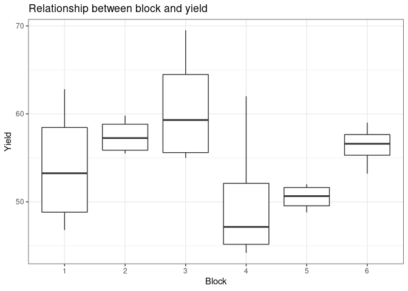
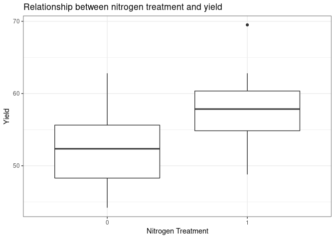

Introduction to R - class 5
================
**Tomek Gaczorek**; <tomek.gaczorek@gmail.com>
09.11.21

<!-- **!!! Decription of exercises is in green !!!** -->
<!-- **!!! Advanced (optional) parts are marked with the red asterixis !!!** -->

**For the use of *dplyr* package (section 4) I highly recommend to print
the [“Cheat
Sheet”](https://rstudio.com/wp-content/uploads/2015/02/data-wrangling-cheatsheet.pdf)
before the classes.**

### 1. Lists

Imagine performing an analysis with many outcomes of different types
(e.g. vectors and data frames). They can be stored as the individual
variables but it is rather inconvenient. To keep all related outcomes in
one variable use the R object called *list*. Think about it as an
organizer where you can name your stuff and arrange it in the right
order. To create a *list* use the *list()* function in the following
way: *list(element_1,element_2,…)*.

**Ex 1. Create a list containing an integer vector from 1 to 60 and the
built-in *npk* dataset. Save it to a variable called *my_list*. Call
it.**  
Expected result:

    [[1]]
     [1]  1  2  3  4  5  6  7  8  9 10 11 12 13 14 15 16 17 18 19 20 21 22 23 24 25
    [26] 26 27 28 29 30 31 32 33 34 35 36 37 38 39 40 41 42 43 44 45 46 47 48 49 50
    [51] 51 52 53 54 55 56 57 58 59 60

    [[2]]
       block N P K yield
    1      1 0 1 1  49.5
    2      1 1 1 0  62.8
    3      1 0 0 0  46.8
    4      1 1 0 1  57.0
    5      2 1 0 0  59.8
    6      2 1 1 1  58.5
    7      2 0 0 1  55.5
    8      2 0 1 0  56.0
    9      3 0 1 0  62.8
    10     3 1 1 1  55.8
    11     3 1 0 0  69.5
    12     3 0 0 1  55.0
    13     4 1 0 0  62.0
    14     4 1 1 1  48.8
    15     4 0 0 1  45.5
    16     4 0 1 0  44.2
    17     5 1 1 0  52.0
    18     5 0 0 0  51.5
    19     5 1 0 1  49.8
    20     5 0 1 1  48.8
    21     6 1 0 1  57.2
    22     6 1 1 0  59.0
    23     6 0 1 1  53.2
    24     6 0 0 0  56.0

You can also give a name to each element of the created list by typing:
*list(“name_1” = element_1,“name_2” = element_2,…)*.

**Ex 2. Create the similar list as in the exercise 1 but call the vector
as ‘internal_vector’ and the data frame as ‘internal_dataset’. Save it
as *new_list* and call it.**  
Expected result:

    $internal_vector
     [1]  1  2  3  4  5  6  7  8  9 10 11 12 13 14 15 16 17 18 19 20 21 22 23 24 25
    [26] 26 27 28 29 30 31 32 33 34 35 36 37 38 39 40 41 42 43 44 45 46 47 48 49 50
    [51] 51 52 53 54 55 56 57 58 59 60

    $internal_dataset
       block N P K yield
    1      1 0 1 1  49.5
    2      1 1 1 0  62.8
    3      1 0 0 0  46.8
    4      1 1 0 1  57.0
    5      2 1 0 0  59.8
    6      2 1 1 1  58.5
    7      2 0 0 1  55.5
    8      2 0 1 0  56.0
    9      3 0 1 0  62.8
    10     3 1 1 1  55.8
    11     3 1 0 0  69.5
    12     3 0 0 1  55.0
    13     4 1 0 0  62.0
    14     4 1 1 1  48.8
    15     4 0 0 1  45.5
    16     4 0 1 0  44.2
    17     5 1 1 0  52.0
    18     5 0 0 0  51.5
    19     5 1 0 1  49.8
    20     5 0 1 1  48.8
    21     6 1 0 1  57.2
    22     6 1 1 0  59.0
    23     6 0 1 1  53.2
    24     6 0 0 0  56.0

**Curiosity**  
Lists can contain any R objects including other lists as well.

### 2. Subsetting the list

The lists similarly to vectors are characterized by one coordinate: the
position of element. You can subset them in the exact same way as
vectors (\[ \]) but then the result will always be a list. This is an
important thing to remember, as forgetting about this rule is the cause
of many frustrating errors.

**Ex 3. Obtain the second element of *my_list* using single square
brackets and save it as a new variable. Call it and check its class.**  
Expected result:

    [[1]]
       block N P K yield
    1      1 0 1 1  49.5
    2      1 1 1 0  62.8
    3      1 0 0 0  46.8
    4      1 1 0 1  57.0
    5      2 1 0 0  59.8
    6      2 1 1 1  58.5
    7      2 0 0 1  55.5
    8      2 0 1 0  56.0
    9      3 0 1 0  62.8
    10     3 1 1 1  55.8
    11     3 1 0 0  69.5
    12     3 0 0 1  55.0
    13     4 1 0 0  62.0
    14     4 1 1 1  48.8
    15     4 0 0 1  45.5
    16     4 0 1 0  44.2
    17     5 1 1 0  52.0
    18     5 0 0 0  51.5
    19     5 1 0 1  49.8
    20     5 0 1 1  48.8
    21     6 1 0 1  57.2
    22     6 1 1 0  59.0
    23     6 0 1 1  53.2
    24     6 0 0 0  56.0

    [1] "list"

To directly extract any specific R object from a list, use double square
brackets (\[\[ \]\]). Remember, however, that it applies only for
subsetting single objects (you cannot obtain several objects in the same
time).

**Ex 4. Obtain the second element of *my_list* using double square
brackets and save it as a new variable. Call it and check its class.**  
Expected result:

       block N P K yield
    1      1 0 1 1  49.5
    2      1 1 1 0  62.8
    3      1 0 0 0  46.8
    4      1 1 0 1  57.0
    5      2 1 0 0  59.8
    6      2 1 1 1  58.5
    7      2 0 0 1  55.5
    8      2 0 1 0  56.0
    9      3 0 1 0  62.8
    10     3 1 1 1  55.8
    11     3 1 0 0  69.5
    12     3 0 0 1  55.0
    13     4 1 0 0  62.0
    14     4 1 1 1  48.8
    15     4 0 0 1  45.5
    16     4 0 1 0  44.2
    17     5 1 1 0  52.0
    18     5 0 0 0  51.5
    19     5 1 0 1  49.8
    20     5 0 1 1  48.8
    21     6 1 0 1  57.2
    22     6 1 1 0  59.0
    23     6 0 1 1  53.2
    24     6 0 0 0  56.0

    [1] "data.frame"

If the elements of a list have their own names you can use them instead
of the coordinates. Do it by typing the name inside square brackets or
use the dollar sign separating list and element names. In the latter
case do not use quotation marks around the element name.

**Ex 5. Extreact the *internal_vector* element of *new_list*.**  
Expected result:

     [1]  1  2  3  4  5  6  7  8  9 10 11 12 13 14 15 16 17 18 19 20 21 22 23 24 25
    [26] 26 27 28 29 30 31 32 33 34 35 36 37 38 39 40 41 42 43 44 45 46 47 48 49 50
    [51] 51 52 53 54 55 56 57 58 59 60

**Curiosity**  
You have probably noticed that the dollar sign was used before for
obtaining given columns from a data frame. It is not a coincidence.
*Data frame* is recognized by R as a special kind of list with each
element being a vector (column) of the same length.

Once you obtained given element of a list you can directly subset it in
the same line of code. For instance to obtain 15<sup>th</sup> element of
*internal_vector* you can type: *new_list$internal_vector\[15\]* or
*new_list\[\[“internal_vector”\]\]\[15\]*.

**Ex 6. Obtain the *yield* column from the second element of the
*new_list*. Type the command in a single line.**  
Expected result:

     [1] 49.5 62.8 46.8 57.0 59.8 58.5 55.5 56.0 62.8 55.8 69.5 55.0 62.0 48.8 45.5
    [16] 44.2 52.0 51.5 49.8 48.8 57.2 59.0 53.2 56.0

### 3. Lists and functions

Functions in R can return only single type of an R object. To visualize
it, perform the example below.

**Ex 7. Calculate the standard deviation of a vector from 5 to 500. Save
it as *my_sd* variable and call it.**  
Expected result:

    [1] 143.3271

Focus on the assignment arrow! Each variable needs to have a unique name
and contain single R object. If the function would return more objects
there is no way to save the outcome as a single variable (you cannot use
assignment arrow).

**Curiosity**  
There are of course some ways to overcome this limitation
(e.g. *assign()* function) but they are outside the scope of this
course.

The simplest solution to return multiple objects from a single function
is to pack them inside a list. It is often used in statistical functions
as the outcome of analysis may contain original data, formula, fitted
values, residuals or even plots.

**Ex 8. Create a function operating over a numerical vector that will
return a list containing the original vector, mean, median and standard
deviation. Test it on a vector from 3 to 1000.**  
Expected result:

    $original
      [1]    3    4    5    6    7    8    9   10   11   12   13   14   15   16   17
     [16]   18   19   20   21   22   23   24   25   26   27   28   29   30   31   32
     [31]   33   34   35   36   37   38   39   40   41   42   43   44   45   46   47
     [46]   48   49   50   51   52   53   54   55   56   57   58   59   60   61   62
     [61]   63   64   65   66   67   68   69   70   71   72   73   74   75   76   77
     [76]   78   79   80   81   82   83   84   85   86   87   88   89   90   91   92
     [91]   93   94   95   96   97   98   99  100  101  102  103  104  105  106  107
    [106]  108  109  110  111  112  113  114  115  116  117  118  119  120  121  122
    [121]  123  124  125  126  127  128  129  130  131  132  133  134  135  136  137
    [136]  138  139  140  141  142  143  144  145  146  147  148  149  150  151  152
    [151]  153  154  155  156  157  158  159  160  161  162  163  164  165  166  167
    [166]  168  169  170  171  172  173  174  175  176  177  178  179  180  181  182
    [181]  183  184  185  186  187  188  189  190  191  192  193  194  195  196  197
    [196]  198  199  200  201  202  203  204  205  206  207  208  209  210  211  212
    [211]  213  214  215  216  217  218  219  220  221  222  223  224  225  226  227
    [226]  228  229  230  231  232  233  234  235  236  237  238  239  240  241  242
    [241]  243  244  245  246  247  248  249  250  251  252  253  254  255  256  257
    [256]  258  259  260  261  262  263  264  265  266  267  268  269  270  271  272
    [271]  273  274  275  276  277  278  279  280  281  282  283  284  285  286  287
    [286]  288  289  290  291  292  293  294  295  296  297  298  299  300  301  302
    [301]  303  304  305  306  307  308  309  310  311  312  313  314  315  316  317
    [316]  318  319  320  321  322  323  324  325  326  327  328  329  330  331  332
    [331]  333  334  335  336  337  338  339  340  341  342  343  344  345  346  347
    [346]  348  349  350  351  352  353  354  355  356  357  358  359  360  361  362
    [361]  363  364  365  366  367  368  369  370  371  372  373  374  375  376  377
    [376]  378  379  380  381  382  383  384  385  386  387  388  389  390  391  392
    [391]  393  394  395  396  397  398  399  400  401  402  403  404  405  406  407
    [406]  408  409  410  411  412  413  414  415  416  417  418  419  420  421  422
    [421]  423  424  425  426  427  428  429  430  431  432  433  434  435  436  437
    [436]  438  439  440  441  442  443  444  445  446  447  448  449  450  451  452
    [451]  453  454  455  456  457  458  459  460  461  462  463  464  465  466  467
    [466]  468  469  470  471  472  473  474  475  476  477  478  479  480  481  482
    [481]  483  484  485  486  487  488  489  490  491  492  493  494  495  496  497
    [496]  498  499  500  501  502  503  504  505  506  507  508  509  510  511  512
    [511]  513  514  515  516  517  518  519  520  521  522  523  524  525  526  527
    [526]  528  529  530  531  532  533  534  535  536  537  538  539  540  541  542
    [541]  543  544  545  546  547  548  549  550  551  552  553  554  555  556  557
    [556]  558  559  560  561  562  563  564  565  566  567  568  569  570  571  572
    [571]  573  574  575  576  577  578  579  580  581  582  583  584  585  586  587
    [586]  588  589  590  591  592  593  594  595  596  597  598  599  600  601  602
    [601]  603  604  605  606  607  608  609  610  611  612  613  614  615  616  617
    [616]  618  619  620  621  622  623  624  625  626  627  628  629  630  631  632
    [631]  633  634  635  636  637  638  639  640  641  642  643  644  645  646  647
    [646]  648  649  650  651  652  653  654  655  656  657  658  659  660  661  662
    [661]  663  664  665  666  667  668  669  670  671  672  673  674  675  676  677
    [676]  678  679  680  681  682  683  684  685  686  687  688  689  690  691  692
    [691]  693  694  695  696  697  698  699  700  701  702  703  704  705  706  707
    [706]  708  709  710  711  712  713  714  715  716  717  718  719  720  721  722
    [721]  723  724  725  726  727  728  729  730  731  732  733  734  735  736  737
    [736]  738  739  740  741  742  743  744  745  746  747  748  749  750  751  752
    [751]  753  754  755  756  757  758  759  760  761  762  763  764  765  766  767
    [766]  768  769  770  771  772  773  774  775  776  777  778  779  780  781  782
    [781]  783  784  785  786  787  788  789  790  791  792  793  794  795  796  797
    [796]  798  799  800  801  802  803  804  805  806  807  808  809  810  811  812
    [811]  813  814  815  816  817  818  819  820  821  822  823  824  825  826  827
    [826]  828  829  830  831  832  833  834  835  836  837  838  839  840  841  842
    [841]  843  844  845  846  847  848  849  850  851  852  853  854  855  856  857
    [856]  858  859  860  861  862  863  864  865  866  867  868  869  870  871  872
    [871]  873  874  875  876  877  878  879  880  881  882  883  884  885  886  887
    [886]  888  889  890  891  892  893  894  895  896  897  898  899  900  901  902
    [901]  903  904  905  906  907  908  909  910  911  912  913  914  915  916  917
    [916]  918  919  920  921  922  923  924  925  926  927  928  929  930  931  932
    [931]  933  934  935  936  937  938  939  940  941  942  943  944  945  946  947
    [946]  948  949  950  951  952  953  954  955  956  957  958  959  960  961  962
    [961]  963  964  965  966  967  968  969  970  971  972  973  974  975  976  977
    [976]  978  979  980  981  982  983  984  985  986  987  988  989  990  991  992
    [991]  993  994  995  996  997  998  999 1000

    $mean
    [1] 501.5

    $median
    [1] 501.5

    $sd
    [1] 288.2421

**An advice**  
You can create an empty list by typing *list()*.

During the last class we have generated many plots. They can be saved
either as image (done before) or as the instruction for R how to
generate them de novo. To use the second option, simply save the code
that generate the plot to a chosen variable.

**Ex 9. Create a list consisting of *npk* dataset and two plots
presenting: 1. Relationship between yield and block. 2. Relationship
between yield and nitrogen treatment.**  
Expected result:

    $dataset
       block N P K yield
    1      1 0 1 1  49.5
    2      1 1 1 0  62.8
    3      1 0 0 0  46.8
    4      1 1 0 1  57.0
    5      2 1 0 0  59.8
    6      2 1 1 1  58.5
    7      2 0 0 1  55.5
    8      2 0 1 0  56.0
    9      3 0 1 0  62.8
    10     3 1 1 1  55.8
    11     3 1 0 0  69.5
    12     3 0 0 1  55.0
    13     4 1 0 0  62.0
    14     4 1 1 1  48.8
    15     4 0 0 1  45.5
    16     4 0 1 0  44.2
    17     5 1 1 0  52.0
    18     5 0 0 0  51.5
    19     5 1 0 1  49.8
    20     5 0 1 1  48.8
    21     6 1 0 1  57.2
    22     6 1 1 0  59.0
    23     6 0 1 1  53.2
    24     6 0 0 0  56.0

    $Block

<!-- -->


    $Nitrogen

<!-- -->

### 4. dplyr

*dplyr* is an extremely popular R package that helps to easily manage
the data frames.

**Ex 10. Install and load the *dplyr* package.**

**Ex 11. Use the download.file() function to download the *rats.txt*
file to your working directory. The url is
‘<https://dl.dropbox.com/s/a0d7f9zxj68jxpb/rats.txt?dl=1>’. Then, import
it, save as *my_data* variable and call it.**  
First 10 rows of expected result:

       Glycogen Treatment Rat Liver
    1       131         1   1     1
    2       130         1   1     1
    3       131         1   1     2
    4       125         1   1     2
    5       136         1   1     3
    6       142         1   1     3
    7       150         1   2     1
    8       148         1   2     1
    9       140         1   2     2
    10      143         1   2     2

**Ex 12. Modify the *my_data* by adding the column with ID at the
beginning.**  
First 10 rows of expected result:

       ID Glycogen Treatment Rat Liver
    1   1      131         1   1     1
    2   2      130         1   1     1
    3   3      131         1   1     2
    4   4      125         1   1     2
    5   5      136         1   1     3
    6   6      142         1   1     3
    7   7      150         1   2     1
    8   8      148         1   2     1
    9   9      140         1   2     2
    10 10      143         1   2     2

All subsequent functions come from the loaded *dplyr* package.  
**Importantly, names of columns provided to *dplyr* functions do not
need quotation marks.**

**SORTING OBSERVATIONS**

To sort the data, use *arrange()* function in the following manner:
*arrange(dataset,ordering_column)*

**Ex 13. Obtain the observations from *my_data* sorted with increasing
levels of glycogen.**  
First 10 rows of expected result:

       ID Glycogen Treatment Rat Liver
    1   4      125         1   1     2
    2  26      125         3   1     1
    3  36      127         3   2     3
    4   2      130         1   1     1
    5   1      131         1   1     1
    6   3      131         1   1     2
    7  25      134         3   1     1
    8  35      134         3   2     3
    9  29      135         3   1     3
    10  5      136         1   1     3

To obtain the descending order put the name of column inside *desc()*
function.

**Ex 14. Obtain the observations from *my_data* sorted with the
decreasing levels of glycogen.**  
First 10 rows of expected result:

       ID Glycogen Treatment Rat Liver
    1  23      162         2   2     3
    2  11      160         1   2     3
    3  13      157         2   1     1
    4  20      155         2   2     1
    5  15      154         2   1     2
    6  18      153         2   1     3
    7  24      152         2   2     3
    8  19      151         2   2     1
    9   7      150         1   2     1
    10 12      150         1   2     3

You can also sort the data by multiple collums. Do it by adding an
additional collumn in the following manner:
*arrange(dataset,ordering_column1,ordering_column2)*. Note that the
priority of sorting is denoted by the order of function arguments.

**Ex 15. Obtain the observations from *my_data* sorted firstly by
‘Treatment’ column and then by ‘Rat’ column. Both in ascending
order.**  
First 10 rows of expected result:

       ID Glycogen Treatment Rat Liver
    1   1      131         1   1     1
    2   2      130         1   1     1
    3   3      131         1   1     2
    4   4      125         1   1     2
    5   5      136         1   1     3
    6   6      142         1   1     3
    7   7      150         1   2     1
    8   8      148         1   2     1
    9   9      140         1   2     2
    10 10      143         1   2     2

**SUBSETTING COLUMNS**

To select particular columns use the *select()* function in the
following way: *select(dataset,column_name1,column_name2)*. Note that
all mentioned columns will be preserved.

**Ex 16. Obtain the ‘Glycogen’ and ‘Liver’ columns from *my_data*.**  
First 10 rows of expected result:

       Glycogen Liver
    1       131     1
    2       130     1
    3       131     2
    4       125     2
    5       136     3
    6       142     3
    7       150     1
    8       148     1
    9       140     2
    10      143     2

You can also use minus preceding the column name which means “all except
this column”.

**Ex 17. Obtain the ‘ID’,‘Glycogen’,‘Treatment’ and ‘Liver’ columns from
*my_data*. Use the minus (-) sign.**  
First 10 rows of expected result:

       ID Glycogen Treatment Liver
    1   1      131         1     1
    2   2      130         1     1
    3   3      131         1     2
    4   4      125         1     2
    5   5      136         1     3
    6   6      142         1     3
    7   7      150         1     1
    8   8      148         1     1
    9   9      140         1     2
    10 10      143         1     2

**SUBSETTING OBSERVATIONS**

To subset the observations, use the *filter()* function in the following
manner: *filter(dataset,your_logical_condition)*. Note that logical
conditions are always related to the values inside a given collumn.

**Ex 18. Obtain the observations for Treatment 1.**  
First 10 rows of expected result:

       ID Glycogen Treatment Rat Liver
    1   1      131         1   1     1
    2   2      130         1   1     1
    3   3      131         1   1     2
    4   4      125         1   1     2
    5   5      136         1   1     3
    6   6      142         1   1     3
    7   7      150         1   2     1
    8   8      148         1   2     1
    9   9      140         1   2     2
    10 10      143         1   2     2

You can also combine several logical conditions by using logical
operators (see Class 3). Note, however, that for each observation under
consideration it needs to result in a single TRUE or FALSE.

**Ex 19. Obtain the observations for Treatment 3 with glycogen level
higher than 135.**  
Expected result:

      ID Glycogen Treatment Rat Liver
    1 27      138         3   1     2
    2 28      138         3   1     2
    3 30      136         3   1     3
    4 31      138         3   2     1
    5 32      140         3   2     1
    6 33      139         3   2     2
    7 34      138         3   2     2

**MODIFYING COLUMNS**

To create a new column based on the others use the *mutate()* function
in the following manner: *mutate(dataset,new_column_name =
recipe_for_values)*. “Recipe for values” is often a mathematical formula
or simple mathematical function based on values of other columns. Note
that it is just a modification of given value for each observation
separately.

**Ex 20. Create a new column called *log_Gly* that will be a natural
logarithm transformation of Glycogen column.**  
First 10 rows of expected result:

       ID Glycogen Treatment Rat Liver  log_Gly
    1   1      131         1   1     1 4.875197
    2   2      130         1   1     1 4.867534
    3   3      131         1   1     2 4.875197
    4   4      125         1   1     2 4.828314
    5   5      136         1   1     3 4.912655
    6   6      142         1   1     3 4.955827
    7   7      150         1   2     1 5.010635
    8   8      148         1   2     1 4.997212
    9   9      140         1   2     2 4.941642
    10 10      143         1   2     2 4.962845

**SUMMARY**

Make a summary of your dataset with the *summarise()* function. The
syntax is as follows: *summarise(dataset,name_of_summary1 =
recipe_for_value1,name_of_summary2 = recipe_for_value2,…)*. Recipe in
that case is any aggregating function (e.g. *mean()*) that will accept
whole column (vector) and result in a single statistics. Note that this
function will result in creation of new table with 1 row of summary
statistics and as many columns as number of statistics mentioned.

**Ex 21. Create a summary of *my_data* containing mean, median, maximum
value, minimum value and standard deviation of Glycogen column.**  
Expected result:

          mean median max_value min_value       sd
    1 142.2222    141       162       125 9.754445

You can also count the number of observations coresponding to the groups
within a given column e.g. check how many observations were collected
for each treatment. To obtain it use the *count()* function by typing
*count(dataset,given_column)*.

**Ex 22. Use count() function to calculate how many Treatments were used
in a study.**  
Expected result:

      Treatment  n
    1         1 12
    2         2 12
    3         3 12

**PIPELINE OPERATOR AND PIPELINE**

As you probably noticed all *dplyr* functions have *data* as the first
argument. Based on this characteristics you can create a pipeline where
the next function uses the output generated by the previous one. In that
case you should provide the dataset argument to the first function only.

Pipeline is created by connecting subsequent functions with *%\>%*
(pipe) operator. Remember to skip the *data* argument in all functions
except for the first one e.g. *select(dataset,column1,column2) %\>%
filter(column1 \> 50)*.

**Ex 23. Using pipeline and *my_data* data frame: 1. select
‘ID’,Glycogen’ and ‘Liver’ column. 2. obtain observations with glycogen
level lower than 140. 3. sort it based on ‘Glycogen’ collumn in
descending order.**  
Expected result:

       ID Glycogen Liver
    1  33      139     2
    2  27      138     2
    3  28      138     2
    4  31      138     1
    5  34      138     2
    6   5      136     3
    7  30      136     3
    8  29      135     3
    9  25      134     1
    10 35      134     3
    11  1      131     1
    12  3      131     2
    13  2      130     1
    14 36      127     3
    15  4      125     2
    16 26      125     1

**GROUPING**

Performing any function over complete dataset is often not what you
really want. Imagine 3 species with a trait of interest. It can be the
case that the overall mean does not reflect the variability among
species. To check value for each species separately you need to group
you dataset. Do it by using *group_by()* function in the following
manner *group_by(dataset,column_with_groups)*. This produces a grouped
dataframe and will cause all subsequent functions to operate on each
group separately.

**Ex 24. Using pipeline, group_by() function and *my_data* data frame,
create a summary table with mean and standard deviation of ‘Glycogen’
column for each treatment separately.**  
Expected result:

    # A tibble: 3 × 3
      Treatment  mean    sd
          <int> <dbl> <dbl>
    1         1  140. 10.3 
    2         2  151   5.66
    3         3  135.  4.71

**An advice** To perform any action on the whole dataset again, use the
*ungroup()* function.

**Ex 25. Using pipeline, group_by() function and *my_data* data frame,
create a new column with the deviations of *Glycogen* values from the
arithmetic mean in a given *Treatment*.**  
Expected result:

    # A tibble: 36 × 6
    # Groups:   Treatment [3]
          ID Glycogen Treatment   Rat Liver Deviations
       <int>    <int>     <int> <int> <int>      <dbl>
     1     1      131         1     1     1        9.5
     2     2      130         1     1     1       10.5
     3     3      131         1     1     2        9.5
     4     4      125         1     1     2       15.5
     5     5      136         1     1     3        4.5
     6     6      142         1     1     3        1.5
     7     7      150         1     2     1        9.5
     8     8      148         1     2     1        7.5
     9     9      140         1     2     2        0.5
    10    10      143         1     2     2        2.5
    # … with 26 more rows

\*\*\*\*\*\*\*\*\*\*\*\*\*\*\*\*\*\*ADVANCED\*\*\*\*\*\*\*\*\*\*\*\*\*\*\*\*\*\*\*\*

**JOINING**

Imagine having two data frames corresponding to the same study system.
In both of them there is a column with individual IDs. How to bind them
together? Using *cbind()* is rather a bad idea as the order of
observations can differ.  
The solution is to use one of the \* …\_join()\* functions:  
1. *left_join()* - join the values from second table (right) that
correspond to observation in the first one (left). If there is no
suitable value in the second table, *NA* is returned.  
2. *right_join()* - join the values from first table (left) that
correspond to observation in the second one (rigth). If there is no
suitable value in the first table, *NA* is returned.  
3. *inner_join()* - return only that observations that have
corresponding values in both tables.  
4. *full_join()* - join what can be joined but keep all observations. In
case of the lack of suitable value, returns *NA*.

Each of the abovementioned functions can be used by typing: \*
…\_join(first_table,second_table,by = “shared_column_name”)\*.  
Notice that the name of shared column should be exactly the same in both
tables (eg. “ID”).

**Ex 26. Execute the code below and then join the observations from
*my_data* and *new_data* data frames. Keep all observations from
*my_data* but only those from *new_data* that have their counterparts in
*my_data*.**

``` r
new_data <- data.frame("ID" = c(2:100),"weight" = rnorm(99,mean = 150,sd = 20))
```

Expected result:

       ID Glycogen Treatment Rat Liver    weight
    1   1      131         1   1     1        NA
    2   2      130         1   1     1  88.61827
    3   3      131         1   1     2 165.97634
    4   4      125         1   1     2 162.89819
    5   5      136         1   1     3 129.93290
    6   6      142         1   1     3 142.56512
    7   7      150         1   2     1 166.01423
    8   8      148         1   2     1 161.78793
    9   9      140         1   2     2 153.03449
    10 10      143         1   2     2 144.20716
    11 11      160         1   2     3 157.56630
    12 12      150         1   2     3 147.33933
    13 13      157         2   1     1 161.09195
    14 14      145         2   1     1  96.21814
    15 15      154         2   1     2 166.45902
    16 16      142         2   1     2 156.68095
    17 17      147         2   1     3 154.16455
    18 18      153         2   1     3 141.12023
    19 19      151         2   2     1 171.82688
    20 20      155         2   2     1 168.77975
    21 21      147         2   2     2 159.82982
    22 22      147         2   2     2 164.91976
    23 23      162         2   2     3 166.36739
    24 24      152         2   2     3 174.27401
    25 25      134         3   1     1 152.04592
    26 26      125         3   1     1 146.28680
    27 27      138         3   1     2 155.59523
    28 28      138         3   1     2 114.67602
    29 29      135         3   1     3 127.17815
    30 30      136         3   1     3 142.38484
    31 31      138         3   2     1 172.07689
    32 32      140         3   2     1 167.45385
    33 33      139         3   2     2 139.66616
    34 34      138         3   2     2 115.90525
    35 35      134         3   2     3 146.15513
    36 36      127         3   2     3 127.03332

**Curiosity**  
1. Using *joins* let us avoid repeating the same information across many
data frames.  
2. The concept of *joins* is common in many computer languages but it is
most often used in databases management (e.g. SQL).

------------------------------------------------------------------------

### 5. Homework

1.  Execute the code below to generate *hw_list* variable. Then replace
    the second element of a list with a built-in *CO2* dataset.

``` r
hw_list <- list("list1" = list("v1" = c(1:5),"v2" = c(6:10)),"vec1" = c(1:100),"dataset" = npk)
```

2.  Create a function that takes a string as the argument and returns a
    vector of single letters from that string. Use *str.split()*
    function.  
3.  Create a function that takes a vector of single letters as the
    argument and returns a list of two elements:  

<!-- -->

1)  the original vector  
2)  vector with 3 random words created out of them. Words do not need to
    make any sense  

<!-- -->

4.  Using *dplyr* package and *CO2* dataset, subset observations from
    Quebec and return the mean of *conc* and *uptake* collumn

\*\*\*\*\*\*\*\*\*\*\*\*\*\*\*\*\*\*ADVANCED\*\*\*\*\*\*\*\*\*\*\*\*\*\*\*\*\*\*\*\*

5.  1)  execute the code below to obtain an *add_table* dataframe.

``` r
add_table <- data.frame("ID" = sample(c(1:nrow(CO2))),"random" = rnorm(nrow(CO2),20,2))
```

2)  add column with ID to the *CO2* dataset. Start with 1.
3)  join both tables using the one of \* …\_join()\* functions  
4)  return the mean for *conc*, *uptake* and *random* column for each
    region (Quebec or Mississippi) separately.

------------------------------------------------------------------------
